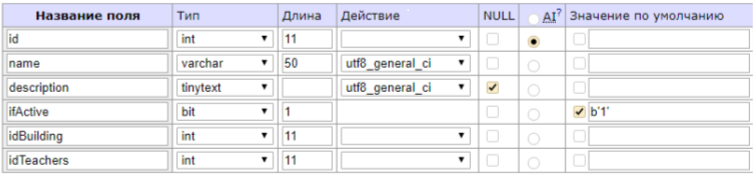

# Практика 2019. 

## Таблица Courses.

В таблице содержится информация о типах документов доступных в системе

Поля:

* id -- int. Идентификатор записи, уникален в пределах таблицы. Заполняется автоматически.
* name -- varchar. Название курса. Максимальная длина: 50 знаков.
* description -- tinytext. Описание типа документа, может быть NULL (отсутствовать).
* ifActive -- bit. Флаг активности данного типа документа, принимает значения 1 или 0.
* idBuilding -- int. Ссылается на id и данные таблицы Building. Соответственно длина зависит от количества строк в таблицу Building.
* idTeachers -- int. Ссылается на id и данные таблицы Teachers. Длина зависит от количества строк в таблице Teachers.

## Web-интерфейс.

Для того чтобы увидеть содержимое таблицы необходимо зайти на http://students.yss.su/PSTGU/2019/gritskova/Practical/table.php

## Исходый код

Исходный код состоит из файла: **table.php**.
В файле есть документирующие комментарии.

